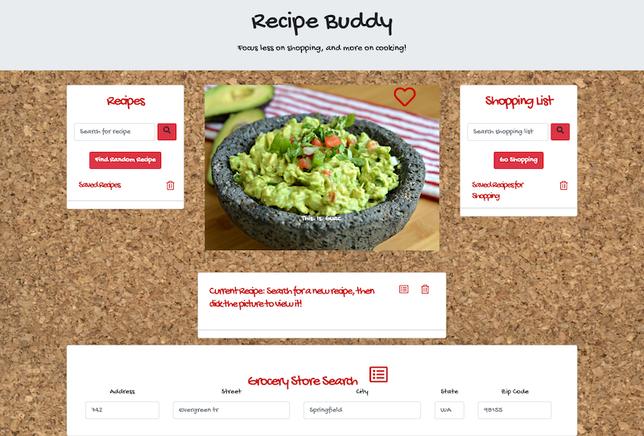

# RecipeBuddy
## Target Audience
Recipe Buddy is intented to help amateur Chefs build a shopping list based on recipes selected from the Internet.



## Table of Contents
- [Usage](#usage)
- [Installation](#installation)
- [Support](#support)
- [Contributors](#contributors)
- [Contributing](#contributing)

## Usage
The user can click the heart to "like" or save a recipe for future reference. Additionally, users can search for a recipe of their choosing which will also be saved in the Database for future reference.

### Search
Recipe buddy will search the Spoonacular API based on user input. It will get recipes back that match the search term.

### Display Recipe
The images returned from the API will be displayed using Bootstrap's Carousel feature.

### Selection 
The user can click on the picture in the carousel and select a recipe to be included in the shopping list. The user can select one or more recipes, as many as suits their needs.

### Build a List
A shopping list comprised of the ingredients from all the selected recipes will be built. It can be displayed on the users mobile device so they can check off items as they get them in the store.

## Installation
Best viewed in Chrome Browser.

OS X:  ``` brew cask install google-chrome ```

Linux/Ubuntu 64-Bit: ``` sudo apt install google-chrome-stable ```

Windows: https://www.google.com/chrome/

## Development setup

This is a web based application. As such, there is no need to install additional software.

## Support

Please [open an issue](https://github.com/jobu206/RecipeBuddy/issues/new) for support.

## Meta

Distributed under the MIT License. See [LICENSE](LICENSE) for more information.

[https://github.com/jobu206/github-link](https://github.com/jobu206/)

## Contributors
- [Greg Lanter](https://github.com/GregoryLanter/)
- [Kevin LeRoy](https://github.com/jobu206)
- [Kurtis Santilla](https://github.com/sitruks)
- [Vera Rodriguez](https://github.com/LIZETHVERA)

## Contributing

1. Fork it (<https://github.com/jobu206/RecipeBuddy/fork>)
2. Create your feature branch (`git checkout -b feature/RecipeBuddy`)
3. Commit your changes (`git commit -am 'Add some yourMessageHere'`)
4. Push to the branch (`git push origin feature/RecipeBuddy`)
5. Create a new Pull Request